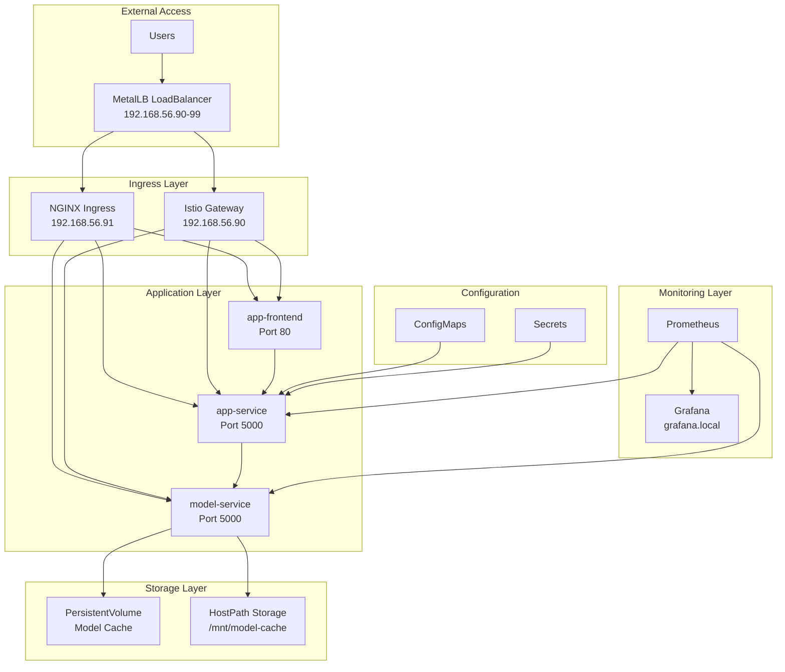
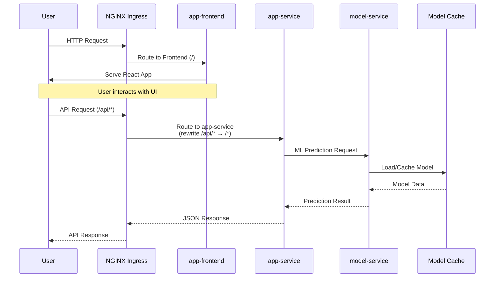
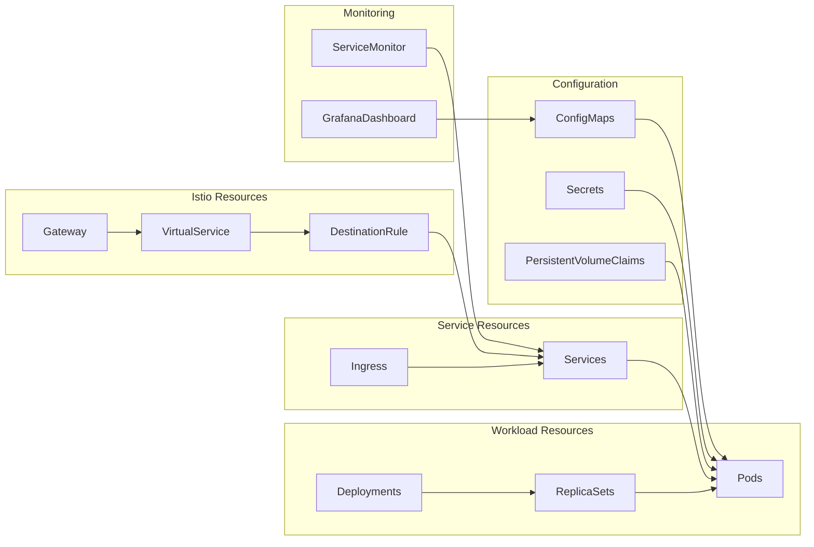
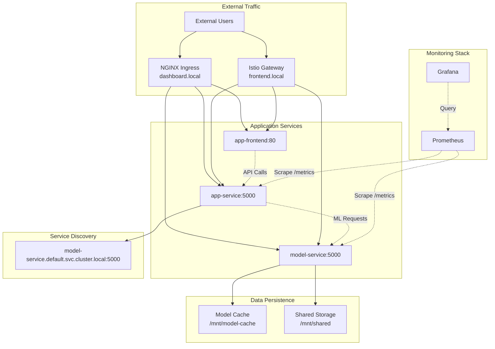
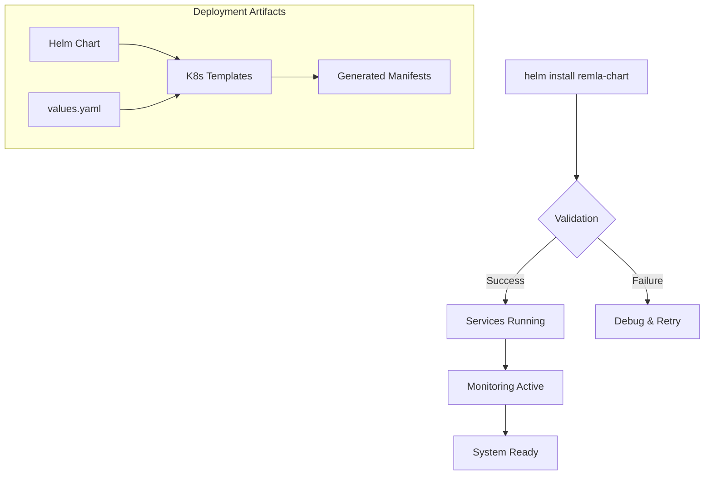

# Deployment Documentation

## Overview

The application is deployed as a microservices architecture on Kubernetes, featuring a machine learning sentiment analysis application with monitoring and traffic management.

## Deployment Structure

### Core Components

The deployment consists of three main application services:

- **app-frontend**: React-based web interface serving the user interface
- **app-service**: Python Flask backend providing API endpoints and business logic
- **model-service**: Machine learning service handling sentiment analysis predictions

### Infrastructure Components

- **Kubernetes Cluster**: Container orchestration platform
- **NGINX Ingress Controller**: HTTP/HTTPS ingress and load balancing
- **Istio Service Mesh**: Advanced traffic management and observability
- **Prometheus + Grafana**: Monitoring and alerting stack
- **MetalLB**: Load balancer for bare-metal Kubernetes

## Architecture Diagram



## Data Flow and Request Routing

### Primary Data Flow



### Dynamic Routing Decisions

The system implements multiple routing mechanisms with dynamic decision points:

#### 1. NGINX Ingress Routing (Primary)

```mermaid
flowchart TD
    REQ[Incoming Request] --> IG[NGINX Ingress]
    IG --> PATHCHECK{Path Analysis}
    
    PATHCHECK -->|/model/apidocs<br/>/model/flasgger_static<br/>/model/apispec_*| MS[model-service<br/>Swagger UI]
    PATHCHECK -->|/app/apidocs<br/>/app/flasgger_static<br/>/app/apispec_*| AS[app-service<br/>Swagger UI]
    PATHCHECK -->|/api/*| REWRITE1[Rewrite to /*<br/>→ app-service]
    PATHCHECK -->|/model/*<br/>(!docs paths)| REWRITE2[Rewrite to /*<br/>→ model-service]
    PATHCHECK -->|/* (default)| AF[app-frontend<br/>SPA Fallback]
```

#### 2. Istio Service Mesh Routing (90/10 Split)

```mermaid
flowchart TD
    ISTIO[Istio Gateway<br/>frontend.local] --> VS[VirtualService]
    VS --> SPLIT{Traffic Split Decision}
    
    SPLIT -->|90% Weight| V1[app-frontend v1<br/>Stable Version]
    SPLIT -->|10% Weight| V2[app-frontend v2<br/>Canary Version]
    
    VS --> APPAPI[/api/* → app-service]
    VS --> MODELAPI[/model/* → model-service]
    
    subgraph "Load Balancing Strategy"
        LB[Consistent Hash<br/>x-sticky-user header]
        V1 --> LB
        V2 --> LB
        APPAPI --> LB
        MODELAPI --> LB
    end
```

## Deployed Resource Types and Relations

### Kubernetes Resources



### Resource Specifications

| Resource Type | Count | Purpose |
|---------------|-------|---------|
| **Deployments** | 3 | app-frontend, app-service, model-service |
| **Services** | 3 | Service discovery and load balancing |
| **Ingress** | 2 | Main routing + rewrite rules |
| **ConfigMaps** | 2+ | Application configuration + Grafana dashboards |
| **Secrets** | 1+ | Sensitive configuration data |
| **PersistentVolumeClaims** | 1 | Model cache storage |
| **ServiceMonitors** | 1 | Prometheus metrics collection |
| **Istio Gateway** | 1 | Service mesh ingress |
| **VirtualServices** | 1 | Traffic routing rules |
| **DestinationRules** | 3 | Load balancing policies |

## Service Interconnections



## Environment Configuration

### Network Configuration
- **IP Range**: 192.168.56.90-192.168.56.99
- **Ingress IP**: 192.168.56.91  
- **Istio IP**: 192.168.56.90
- **Ingress Class**: nginx

### Service Endpoints
- **Frontend**: `http://frontend.local/` (Istio) or `http://192.168.56.91/` (NGINX)
- **App Service API**: `http://192.168.56.91/api/*`
- **Model Service API**: `http://192.168.56.91/model/*`
- **Grafana Dashboard**: `http://grafana.local/`
- **Service Documentation**: 
  - App Service: `http://192.168.56.91/app/apidocs`
  - Model Service: `http://192.168.56.91/model/apidocs`

## Deployment Process

### Infrastructure Provisioning

The deployment uses Ansible playbooks for infrastructure setup:

1. **General Setup** (`general.yml`): Base system configuration on all nodes
2. **Controller Setup** (`ctrl.yml`): Kubernetes master node initialization
3. **Node Setup** (`node.yml`): Worker node joining and configuration
4. **Monitoring Setup** (`monitoring-alerting.yml`): Prometheus/Grafana stack
5. **Finalization** (`finalization.yml`): Final configuration and validation

### Application Deployment

The application stack is deployed using Helm charts with the following pattern:



## Traffic Management Strategies

### Canary Deployments (Istio)
- **90%** traffic to stable version (v1)
- **10%** traffic to canary version (v2)
- Consistent hashing based on `x-sticky-user` header

### Path-Based Routing (NGINX)
- **API paths** (`/api/*`, `/model/*`) with URL rewriting
- **Documentation paths** without rewriting
- **SPA fallback** for all other paths to frontend

### Load Balancing
- **Session affinity** using consistent hashing
- **Health checks** for service availability
- **Circuit breaking** through Istio policies

## Monitoring and Observability

### Metrics Collection
- **Prometheus** scrapes metrics from `/metrics` endpoints
- **ServiceMonitor** resources define scraping configuration
- **Custom dashboards** in Grafana for application insights

### Key Metrics Monitored
- HTTP request rates and latencies
- Model prediction accuracy and response times
- Resource utilization (CPU, memory, storage)
- Error rates and availability

This documentation provides comprehensive coverage for new team members to understand the deployment architecture and contribute effectively to design discussions and system improvements.

