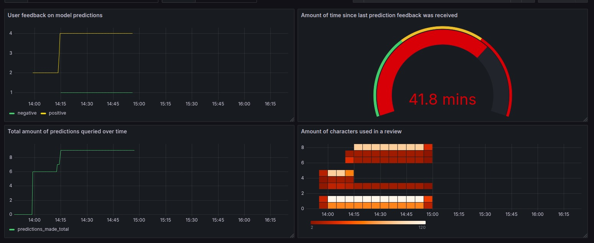

# Operation

This repository contains the operational configuration to run our complete application stack, including deployment files and documentation. The list below links to the specific, stable versions of each microservice and library that constitute the current deployment.

* app-frontend: [v1.5.1](https://github.com/remla25-team3/app-frontend/tree/v1.5.1)
* app-service: [v1.6.0](https://github.com/remla25-team3/app-service/tree/v1.6.0)
* lib-ml: [v0.5.0](https://github.com/remla25-team3/lib-ml/tree/v0.5.0)
* lib-version: [v1.2.0](https://github.com/remla25-team3/lib-version/tree/v1.2.0)
* model-service: [v0.5.0](https://github.com/remla25-team3/model-service/tree/v0.5.0)
* model-training: [v0.2.3](https://github.com/remla25-team3/model-training/tree/v0.2.3)
* operation: [this repo](https://github.com/remla25-team3/operation)

For a detailed, itemized checklist of our compliance with the course rubrics for each assignment, please see the `RUBRICS.md` file in this repository.

---

## 🚀 Docker Compose Deployment

You can deploy the entire REMLA project with a single command. Our Docker Compose setup implements:

- **ENV configuration** via a `.env` file (e.g. `NGINX_PORT=8080`, `APP_PORT=3000`, `MODEL_PORT=5000`, and example Docker secret).
- **Port mappings** so only `app-frontend` is exposed on your host.
- **Volume mapping** for model caching.
- **Restart policies** (`restart: unless-stopped`) for all services.
- **Docker secret** example for sensitive data (`test_secret`).

### Start Up
From the root directory, run:
```bash
docker-compose up -d  # Bring up all services in detached mode
```
### Access the services:
- **Frontend UI**: http://localhost:8080/
- **App-service API Docs (Swagger)**: http://localhost:8080/app/apidocs
- **Model-service API Docs (Swagger)**: http://localhost:8080/model/apidocs

### Shut Down
```bash
docker-compose down
```

---

## 🚀 Deploying with Kubernetes

This project can be deployed to two different Kubernetes environments:

- **Provisioned Cluster**: A multi-node cluster running on dedicated VMs, managed by Vagrant and Ansible.

- **Minikube**: A single-node local cluster for quick testing.

Please follow the instructions for the environment you are using.

---

### A) 🚀 Deploying to the Provisioned Cluster

These steps will set up the virtual machines, provision a complete Kubernetes cluster, and deploy the application.

1. **Prerequisites**

    - Vagrant & VirtualBox installed.

    - Ansible installed on your host machine.

    - Sufficient permissions to edit /etc/hosts (or your system's equivalent).

    - Your SSH public key (e.g., ~/.ssh/id_rsa.pub) copied into the <repo-dir>/provisioning/public_keys/ directory to enable SSH access.

2. **Provision the Cluster Infrastructure**

These commands will create the VMs, install Kubernetes, and configure all necessary services like MetalLB and NGINX Ingress.
```bash
# Clone the repository (if you haven't already)
git clone git@github.com:remla25-team3/operation.git

# Navigate to the project root
cd operation

# Start and provision the VMs
vagrant up

# Run the finalization playbook to install cluster services
ansible-playbook -u vagrant -i 192.168.56.100, provisioning/finalization.yml
```
3. **Deploy the Application**

Once the cluster is running, ssh into ctrl and watch.
```bash
vagrant ssh ctrl
kubectl get pods -A --watch
```
4. **Access the Application**

The application is exposed via the NGINX Ingress Controller, which has a stable external IP.

Check the Ingress IP:
```bash
kubectl get service -n ingress-nginx
```
Confirm the EXTERNAL-IP for the ingress-nginx-controller is 192.168.56.91.

Access in Browser: Open your browser and navigate to the following URLs:

- **Main Application**: http://192.168.56.91/

- **App Service API Docs**: http://192.168.56.91/app/apidocs

- **Model Service API Docs**: http://192.168.56.91/model/apidocs

- **Prometheus**: http://192.168.56.93/

- **Grafana**: http://192.168.56.92/


5. **Access the Kubernetes Dashboard (Optional)**

Add Host Entry: Edit your local /etc/hosts:
```bash
sudo nano /etc/hosts
```
Add the following line to the bottom of the file:

```bash
192.168.56.91   dashboard.local
```
Save and exit nano: Press Ctrl + O (to write the file), then Enter, then Ctrl + X (to exit)

Open your browser and visit: https://dashboard.local

To log in, run the following command on the controller VM to generate a token:
```bash
vagrant ssh ctrl
kubectl -n kubernetes-dashboard create token admin-user
```

Paste the token into the Dashboard login screen.

Exit the Controller VM: Once you have retrieved the token, you can exit the controller VM by pressing Ctrl + D

6. **Cleaning Up**

To stop and delete all virtual machines, run the following command from the project root:
```bash
vagrant destroy -f
```

---

### 🚀 B) Deploying to Minikube

These instructions are for running the application on a local Minikube cluster with the Istio service mesh for traffic management, rate limiting, and experimentation.

#### 1. Prerequisites
- macOS or Linux (host operating system)
- Helm 3 CLI
- Istioctl (tested with version 1.26.0)
- `sudo` privileges are required to run `minikube tunnel`.

#### 2. Installation Steps

Follow these steps in order to set up the cluster and deploy the application.

1.  **Start Your Local Cluster**
```bash
# Start the Minikube cluster with the recommended resources
minikube start --memory=4096 --cpus=4 --driver=docker
```

2.  **Install Istio and Prepare Namespace**
```bash
# Install Istio's control plane and gateway resources
istioctl install --set profile=default -y

# Label the 'default' namespace to enable automatic Istio sidecar injection
kubectl label namespace default istio-injection=enabled
```

3.  **Install Monitoring Stack**
```bash
# Add the Prometheus community Helm repository
helm repo add prometheus-community https://prometheus-community.github.io/helm-charts

# Install the Prometheus stack for monitoring
helm install prometheus-stack prometheus-community/kube-prometheus-stack -n monitoring --create-namespace -f prometheus-values.yaml
```

4.  **Deploy the Application**
```bash
# Navigate to the Helm chart directory
cd operation/k8s/remla-chart/

# Install the application using Helm
helm install releasename .

# Watch the pods until they are all 'Running' and '2/2' READY
kubectl get pods --watch
```

#### 3. Accessing the Application

Accessing the application requires using `minikube tunnel` and editing your local hosts file.

Add Host Entry: Edit your local /etc/hosts:
```bash
sudo nano /etc/hosts
```
Add the following line to the bottom of the file:

```bash
127.0.0.1   frontend.local
```
Save and exit nano: Press Ctrl + O (to write the file), then Enter, then Ctrl + X (to exit)

Now, start the tunnel and leave this terminal open.
```bash
minikube tunnel
```

4. **Access the Application**

Access in Browser: Open your browser and navigate to the following URLs:

- **Main Application**: http://frontend.local/

- **App Service API Docs**: http://frontend.local/app/apidocs

- **Model Service API Docs**: http://frontend.local/model/apidocs

> Note: We apply local rate limiting to app-service, so you will be able to interact with app-service for a maximum of 6 times per minute. The frontend page, however, can be reload up to 10 times, as that is the setting for global rate limiting. Addional rule: you can query http://frontend.local/model/health for a maximum of 2 times per minute.


- **Grafana**
http://grafana.local/




5. **Cleaning Up**
```bash
# Uninstall the application from your cluster
helm uninstall releasename

# Delete the Minikube cluster entirely
minikube delete
```
---
