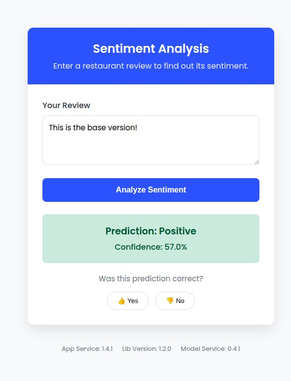
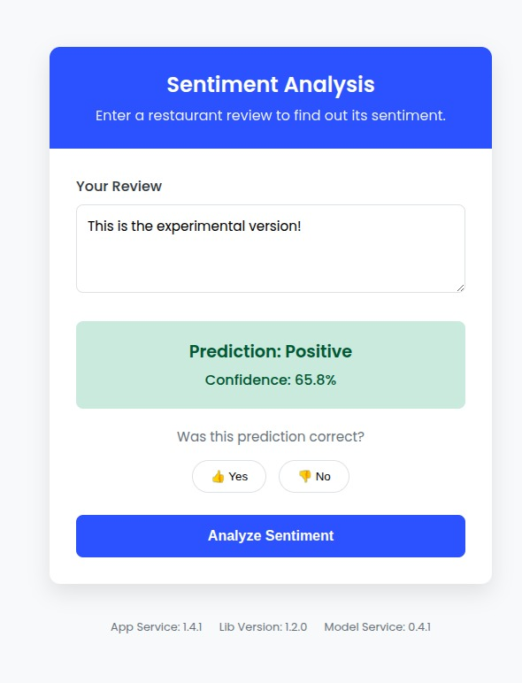

# Experiment: User Interface Engagement Testing

# Overview
This experiment will test if moving the prediction button away from the text input field affects the amount of prediction requests made by the user. 

# Deploying the Experiment
You can view both conditions of the experiment yourself. With the deployment of the app two frontend versions are deployed, one of which is the base version and the other the experimental version, with the only change from the experiment that the experimental version is made green so you know when you are in that condition. To view the two versions of the frontend, enter ```frontend.local``` in your web browser (after deployment). You will see one version of the app. Now you can refresh the page untill you see the other version.

# Changes
Compared to the base design of our frontend, the "Analyze Sentiment" button is moved below the prediciton feedback buttons after a prediction has been made. 
See the Figure for a visualization. This change means that in the experimental version, consecutive uses of the app require more mouse movement from the user (from input text box to analysis button) compared to the base version.





# Relevant Metrics
To analyze changes in user engagement, we will look at the ```predictions_made_total``` metric for both the base version and the experimental release of the app. This metric indicates how many predictions where made in that version of the app in total. If this metric reports higher in one version of the app compared to the other, it is thus indicative of the app being used more in that state, compared to the other.

# Hypothesis
We hypothesize that the experimental release will have a lower amount of ```predictions_made_total``` compared to the base version. As users need to move their mouse more to query a prediction, the app becomes less efficient to use. We expect this to make the user experience worse and thus that users will query less consecutive predictions from the app.

# Decision Process
For one user, the base design is deployed, for another user, the experimental design is deployed. We let both users interact with the app. This generates metrics for ```predictions_made_total```. We can view this metric for both versions in a grafana dashboard panel. From this panel, we can infer by the height of the timeseries data, we can infer for which version of the app more predictions were made. We use this to decide whether the base version or the experimental version of the app induces more user engagement.

# Grafana Results


# Limitations
As we have not released our app to the world, the data shown on grafana is mocked. As such, no conclusions can be made from our results.
