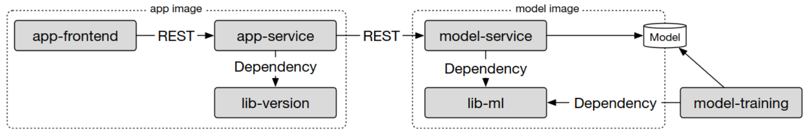
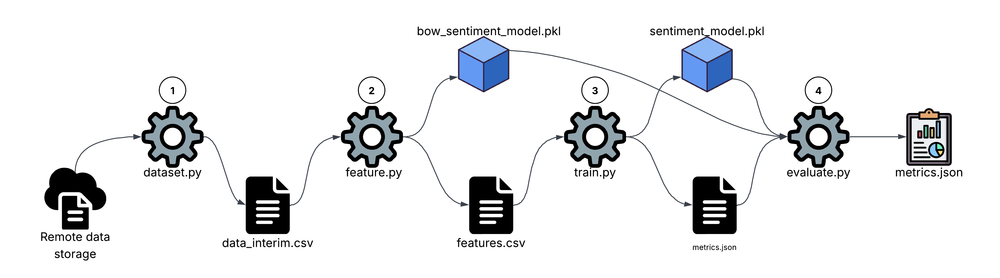
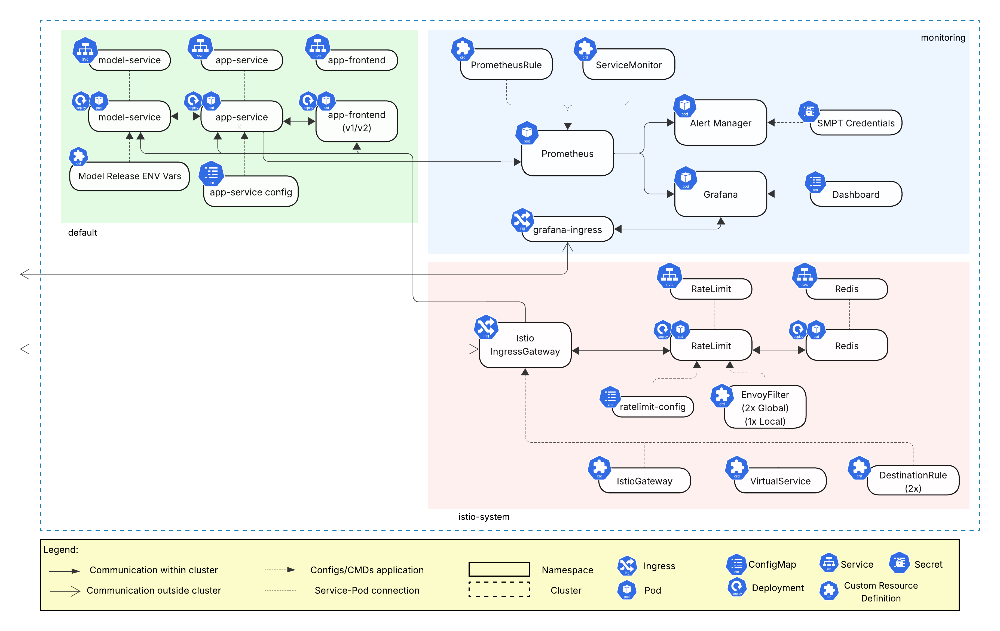
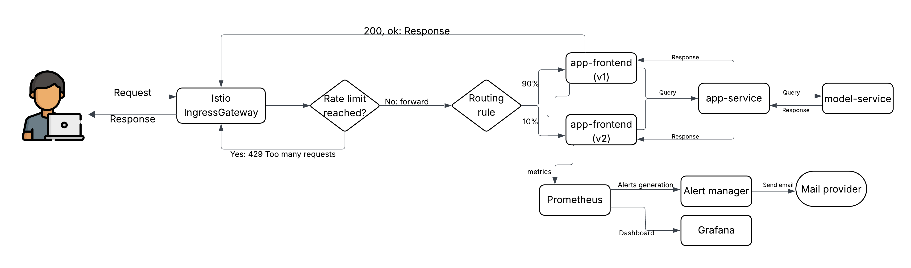
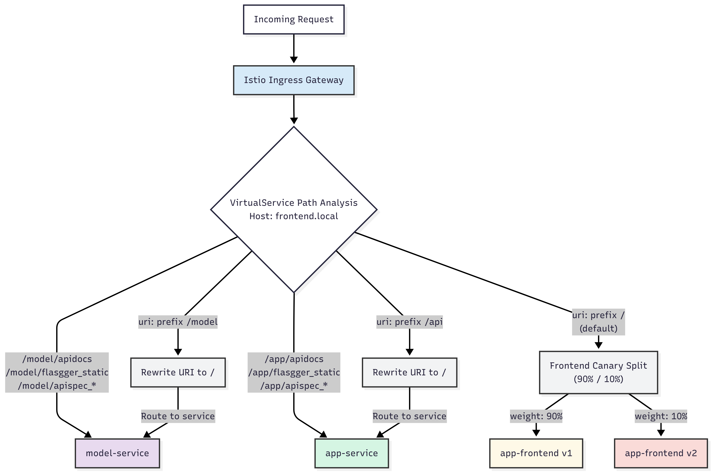
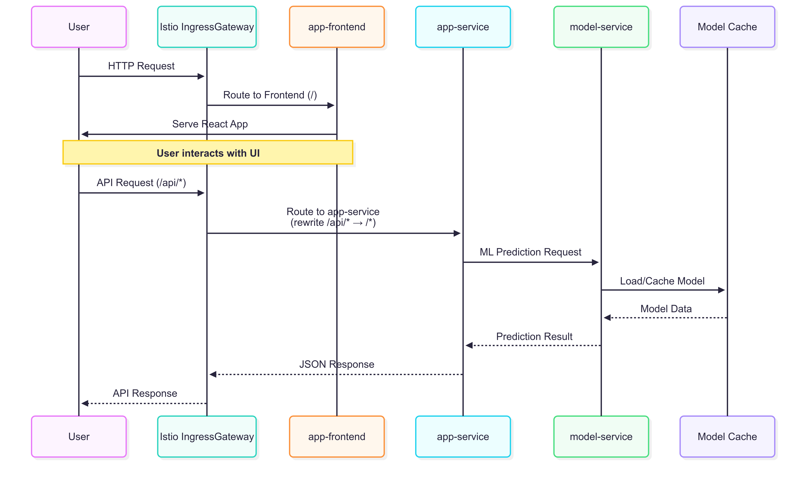
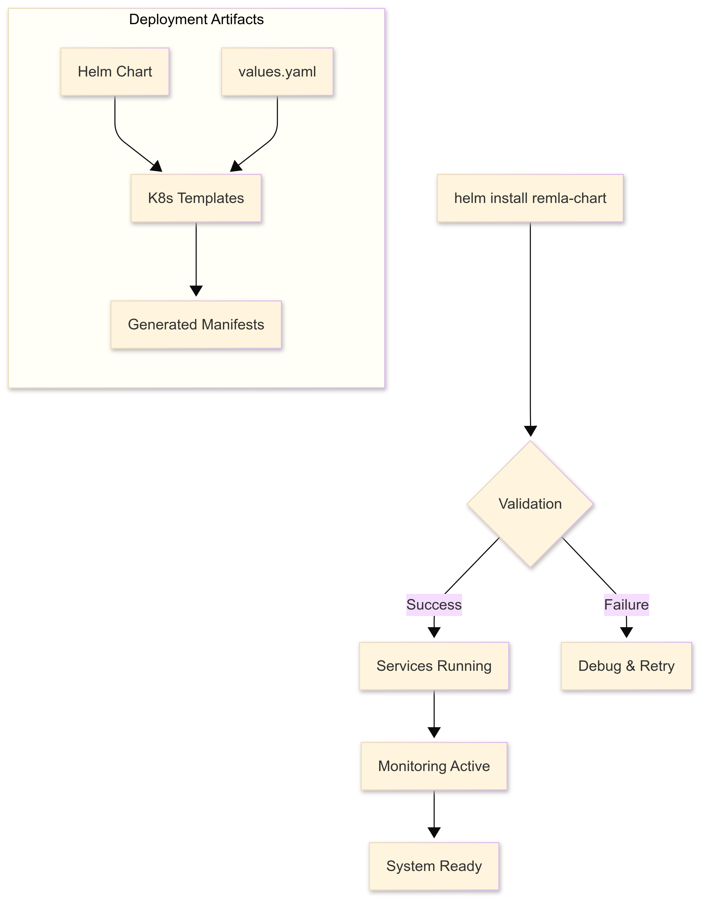

# Deployment Documentation

> Links to the repositories cited in this document can be found at the start of the README of this same repository (`operation`)
## Project overview

This project provides a sentiment analysis platform for restaurant reviews. Our system is built on a distributed, microservices-based architecture designed for scalability and independent development. The project is composed of several distinct repositories, including three core containerized services, two shared libraries, and a model training pipeline. Here are illustrated the high-level design and the interactions between these components:

### Core Services

Our application's functionality is delivered through three main services, each packaged as a distinct container image:

- **`app-frontend`**: This is the client-facing component of our application. It is a single-page application (SPA) that provides the user interface for submitting reviews and viewing results. It communicates with the backend exclusively through REST API calls to the app-service.

- **`app-service`**: This service acts as the primary backend and API gateway. It handles incoming requests from the frontend, manages business logic, and orchestrates communication with the machine learning service for sentiment analysis.

- **`model-service`**: A specialized microservice dedicated to ML inference. It exposes a REST endpoint that accepts text input and returns a sentiment prediction. This service loads versioned models from a dedicated model store, which are produced by our offline training pipeline.

Continuous integration and deployment for these services are managed via GitHub Actions, enabling automated releases of new container versions.

### Shared Libraries

To ensure consistency and reduce code duplication, our services rely on two shared Python libraries:

- **`lib-ml`**: This library contains all the logic for pre-processing raw text. It is a critical dependency for both the `model-training` pipeline (to process training data) and the `model-service` (to process incoming prediction requests), guaranteeing that the same transformations are applied in both training and inference.

- **`lib-version`**: A simple utility library that allows the app-service to query and report on the current version of its components, which can be useful for debugging and monitoring.

These libraries are also automatically versioned and published using GitHub Actions.

### Supporting Repositories

- **`model-training`**: This repository contains the pipeline responsible for training, evaluating, and publishing new versions of our sentiment analysis model. Its output is a versioned model artifact that gets stored for the `model-servic`e to consume. It is not run as part of the live application.

- **`operation`**: This repository is the central hub for deployment and infrastructure-as-code. It contains all documentation, configuration files, and automation scripts for Docker, Kubernetes, Ansible, and other operational tooling.

## ML Pipeline

The model-training repository contains our complete machine learning pipeline.

### Tooling and Quality Assurance

To ensure our models are robust and reliable, we have integrated several industry-standard tools and methodologies into our workflow:

- **DVC** (Data Version Control): We use DVC to define, manage, and version our entire ML pipeline. This allows any team member to reproduce experiments precisely by tracking dependencies between code, data, and model artifacts. All large files, such as datasets and models, are versioned with DVC and stored in a shared remote storage (Google Drive), keeping the Git repository lightweight.

- **Comprehensive Testing** (ML Test Score): Our testing strategy is built around the ML Test Score, a methodology inspired by Google's best practices. Using pytest, our test suite covers data integrity, model behavior, and infrastructure correctness.

- **Code Quality and Linting**: We enforce a high standard of code quality using a suite of linters. Pylint, Flake8, and Bandit are run automatically in our CI pipeline to check for logical errors, style consistency, and potential security vulnerabilities. This applies to both our source code and our test code, ensuring clarity and maintainability across the entire project.

### Pipeline Stages

The end-to-end training process is broken down into four distinct stages, as visualized in the diagram below. This modular structure, managed by DVC, ensures that only the necessary parts of the pipeline are re-run when changes are made.

The pipeline executes as follows:

- **Prepare**: This initial stage is responsible for data ingestion. It runs the `dataset.py` script to fetch the raw dataset (`a1_RestaurantReviews_HistoricDump.tsv`) from remote storage and performs initial processing to create a clean, interim dataset (`data_interim.csv`).

- **Featurize**: Taking the interim data, this stage generates the features required for model training. It runs the `features.py` script, which produces two key artifacts: a file with the processed features (`features.csv`) and the `bow_sentiment_model.pkl`, which is the CountVectorizer used to transform text into numerical vectors.

- **Train**: This stage uses the processed features to train the final sentiment analysis model. The `train.py` script outputs the trained classifier (`sentiment_model.pkl`) and splits the data into test sets (`X_test.csv`, `y_test.csv`) that will be used for performance validation.

- **Evaluate**: In the final stage, the `evaluate.py` script assesses the performance of the trained model using the test sets. It loads both the classifier and the vectorizer to ensure the evaluation mirrors a real-world scenario. The results, including key metrics like accuracy and F1-score, are saved to `metrics.json`.

## Deployment Structure

### Core Components

The deployment consists of three main application services cited before: `app-frontend`, `app-service` and `model-service`.

### Infrastructure Components

- **Kubernetes Cluster**: Container orchestration platform
- **NGINX Ingress Controller**: HTTP/HTTPS ingress and load balancing
- **Istio Service Mesh**: Advanced traffic management and observability
- **Prometheus + Grafana**: Monitoring and alerting stack
- **MetalLB**: Load balancer for bare-metal Kubernetes

## Architecture Diagram
Deployment Architecture

Our application runs on a Kubernetes cluster that is provisioned on using Vagrant and Ansible or by manually configuring the deployment with minikube (see README). This section details the structure and key components of our deployment, which are visually summarized in the following Figure. The diagram provides a high-level overview of the deployed resources, their relationships, and their logical grouping within Kubernetes namespaces.

Our Helm chart orchestrates the deployment of all application-specific and service mesh components, which are organized into the following namespaces:

1. The **default** Namespace: Core Application Services

This namespace houses the core services that constitute our application:

- Three distinct microservices, each with its own Deployment and Service: `app-frontend`, `app-service` and `model-service`
- Service Configuration:
    - An app-service config ConfigMap injects runtime configuration into the backend.
    - Environment variables (Model Release ENV Vars) are used to inform the model-service where to download its ML model artifacts.

The monitoring Namespace: Observability Stack

We use the popular kube-prometheus-stack Helm chart to deploy a comprehensive monitoring solution into its own dedicated namespace. Key components include:
- Prometheus: For time-series data collection and alerting.
- Grafana: For visualizing metrics through pre-configured dashboards.
- AlertManager: For handling and routing alerts from Prometheus.
- Configuration Resources:
    - A ServiceMonitor that configures Prometheus to scrape the metrics on our app-service.
    - A PrometheusRule that defines the specific alert conditions.
    - SMTP Credentials stored in a Secret for sending email notifications.

2- The **istio-system** Namespace: Service Mesh and Ingress

This namespace contains the Istio control plane and manages all ingress traffic and advanced network policies for our application.
- Istio IngressGateway: The single entry point for all application traffic. It is configured by several Istio Custom Resource Definitions (CRDs):
    - A Gateway to open the port.
    - A VirtualService to perform path-based routing to the app-frontend, app-service, and model-service.
    - DestinationRule resources to manage traffic policies, such as the 90/10 split for the frontend canary release.
    - Rate Limiting: Our implementation uses a dual strategy configured via EnvoyFilter resources:
        - Global Rate Limiting: A dedicated RateLimit service, backed by Redis, enforces cluster-wide limits.
        - Local Rate Limiting: A second filter applies a specific rate limit directly to the app-service sidecar for fine-grained control.

## Data Flow and Dynamic Routing

This section details the end-to-end lifecycle of a user request within our system. It covers how traffic is initially handled, the dynamic routing decisions made by the service mesh, the interactions between microservices, and how our observability stack is integrated. The overall flow is visualized here:

1. Initial Request and Ingress Processing

A user's journey begins with an HTTP request to our application's domain. Every request is first handled by the Istio IngressGateway, which serves as the single, secure entry point to the cluster.

Immediately upon entry, the gateway performs two critical actions:
- Rate Limiting: The request is checked against our defined rate limits. If the user has sent too many requests in a given timeframe, the gateway rejects the request with a 429 Too Many Requests status code, protecting our services from overload.
- Routing Rules: If the request is within the rate limits, the gateway forwards it to Istio's VirtualService to determine the correct destination based on the URL path.

2. Dynamic Routing Decisions and Canary Release

Our VirtualService implements sophisticated path-based routing to direct traffic to the appropriate backend service. This logic provides flexibility and enables advanced deployment strategies like canary releases.

The primary routing rules are as follows:
- **API Documentation**: Requests to specific API documentation paths (e.g., /model/apidocs or /app/apidocs) are routed directly to the corresponding service for developers.
- **Backend Services**: API calls with prefixes like /api/* or /model/* are routed to the app-service or model-service, respectively. The VirtualService also rewrites the URI to simplify the endpoint logic within the services.
- **Frontend Canary Release**: All other traffic, including requests to the root (/), is directed to the app-frontend. Here, we implement a canary release, splitting traffic 90% to the stable v1 version and 10% to the newer v2 version. This allows us to test new features safely with a small subset of users.

3. Application and Service-to-Service Flow

Once the initial routing is complete, the request flows through our microservices:

- The app-frontend is served to the user's browser. As the user interacts with the UI, the frontend makes API calls to our backend.

- These API calls are directed by the gateway to the app-service, which contains the core business logic.

- For sentiment analysis, the app-service sends a prediction request to the model-service.

- The model-service loads the required ML model artifacts from its cache and returns the prediction result to the app-service.

- The app-service formats the final JSON response, which travels back through the gateway to the user's browser.

4. Integrated Observability Loop

In parallel to the user-facing flow, our system continuously gathers data for monitoring and alerting:
- The app-frontend emits metrics which are scraped by Prometheus.
- Prometheus evaluates these metrics against predefined PrometheusRules. If an alert condition is met (e.g., high error rate), it triggers an alert.
- AlertManager receives the alert and forwards it to the appropriate notification channel, i.e., sending an email via an SMTP provider.
- All metric data is also available in Grafana, which provides dashboards for visualizing the health and performance of the system in real-time.

## Deployment Process

### Infrastructure Provisioning

The deployment using Ansible playbooks for infrastructure setup works, in short, like this:

1. **General Setup** (`general.yml`): Base system configuration on all nodes
2. **Controller Setup** (`ctrl.yml`): Kubernetes master node initialization
3. **Node Setup** (`node.yml`): Worker node joining and configuration
4. **Monitoring Setup** (`monitoring-alerting.yml`): Prometheus/Grafana stack
5. **Finalization** (`finalization.yml`): Final configuration and validation

### Application Deployment

Our application stack is deployed to Kubernetes using a Helm chart, which standardizes and automates the entire rollout process. The workflow, visualized in the next Figure, ensures a consistent and reliable deployment.

The process is initiated by the helm install command. Helm combines the templates in our chart with custom configurations from the values.yaml file to generate the final Kubernetes manifests. After a validation step, a successful deployment results in all services running and the monitoring systems becoming active. If any part of the process fails, it enters a debug and retry cycle.

