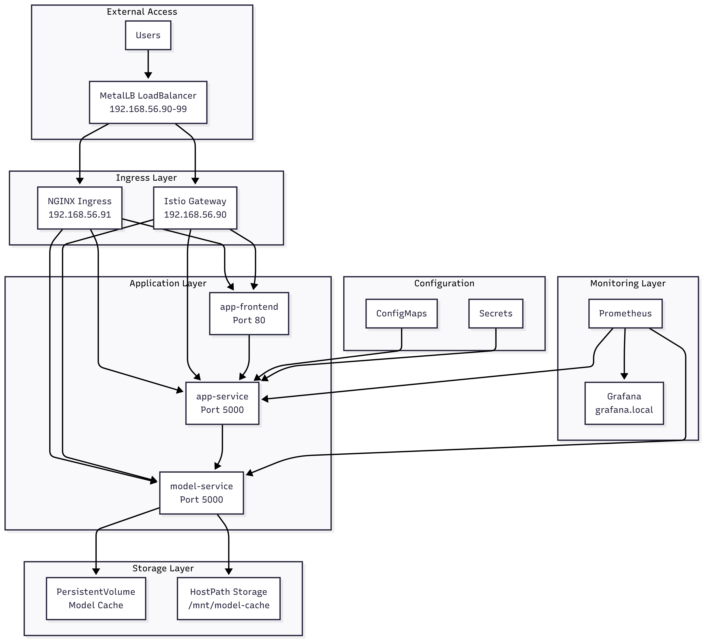
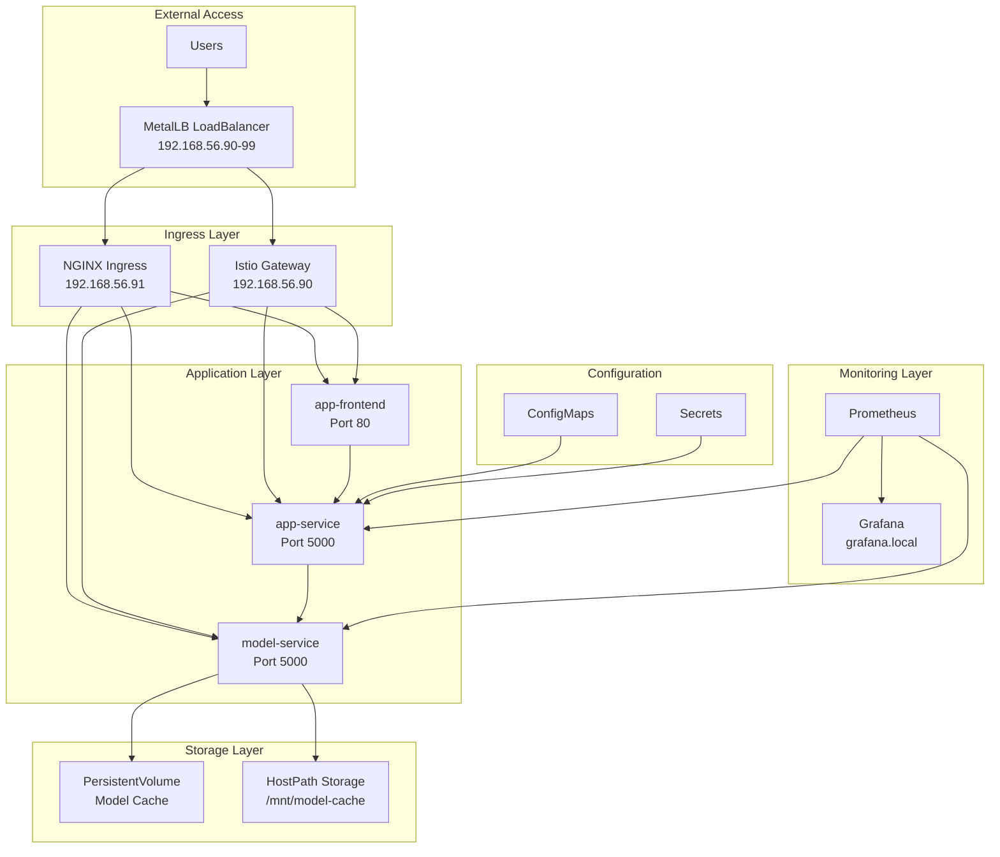
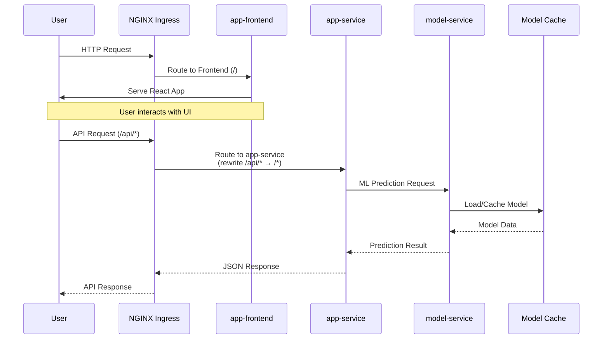
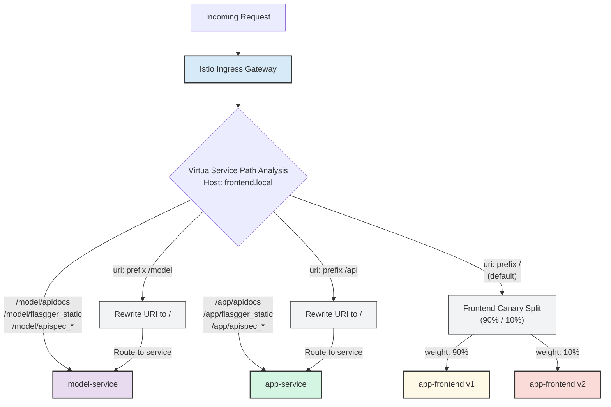
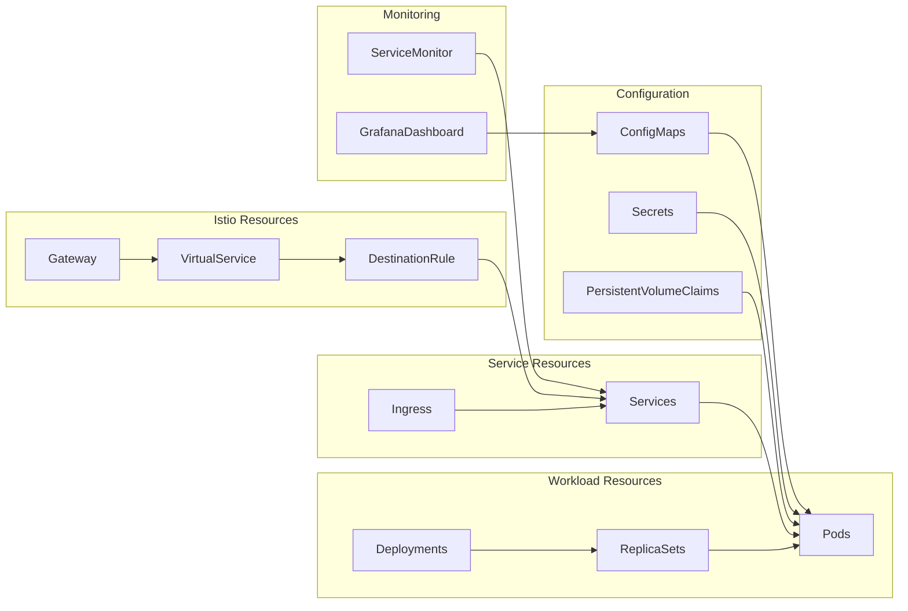
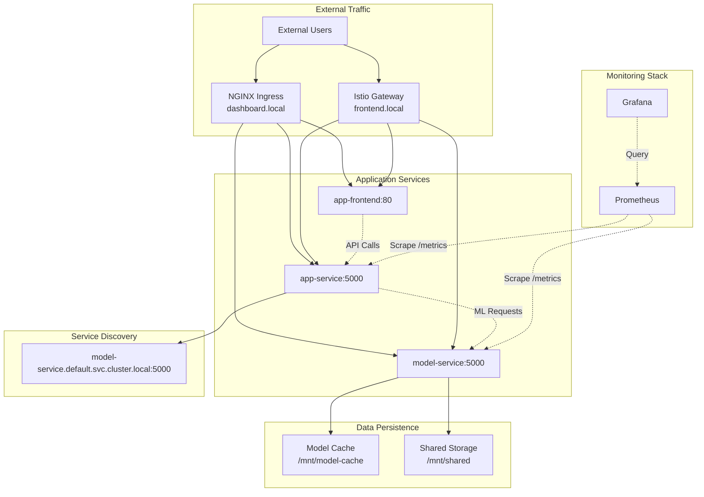
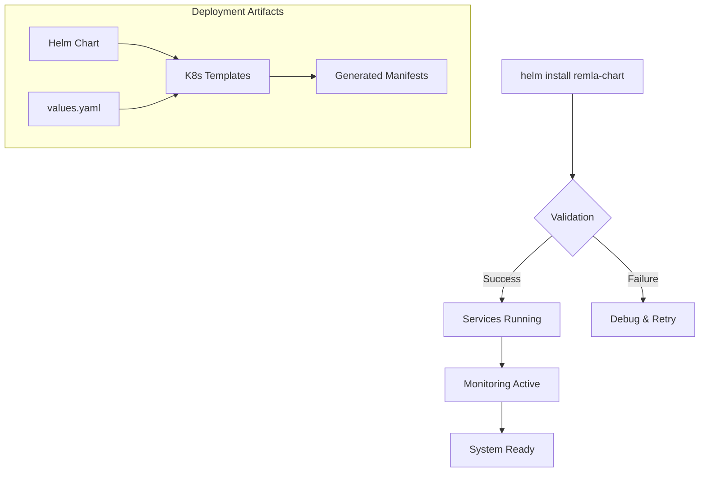

# Deployment Documentation

## Overview

This document details the deployment structure and data flow in our application.... maybe add overall explanation

## Project overview

This project provides a sentiment analysis platform for restaurant reviews. Our system is built on a distributed, microservices-based architecture designed for scalability and independent development. The project is composed of several distinct repositories, including three core containerized services, two shared libraries, and a model training pipeline. Figure 1 illustrates the high-level design and the interactions between these components.

### Core Services

Our application's functionality is delivered through three main services, each packaged as a distinct container image:

- **`app-frontend`**: This is the client-facing component of our application. It is a single-page application (SPA) that provides the user interface for submitting reviews and viewing results. It communicates with the backend exclusively through REST API calls to the app-service.

- **`app-service`**: This service acts as the primary backend and API gateway. It handles incoming requests from the frontend, manages business logic, and orchestrates communication with the machine learning service for sentiment analysis.

- **`model-service`**: A specialized microservice dedicated to ML inference. It exposes a REST endpoint that accepts text input and returns a sentiment prediction. This service loads versioned models from a dedicated model store, which are produced by our offline training pipeline.

Continuous integration and deployment for these services are managed via GitHub Actions, enabling automated releases of new container versions.

### Shared Libraries

To ensure consistency and reduce code duplication, our services rely on two shared Python libraries:

- **`lib-ml`**: This library contains all the logic for pre-processing raw text. It is a critical dependency for both the `model-training` pipeline (to process training data) and the `model-service` (to process incoming prediction requests), guaranteeing that the same transformations are applied in both training and inference.

- **`lib-version`**: A simple utility library that allows the app-service to query and report on the current version of its components, which can be useful for debugging and monitoring.

These libraries are also automatically versioned and published using GitHub Actions.

### Supporting Repositories

- **`model-training`**: This repository contains the pipeline responsible for training, evaluating, and publishing new versions of our sentiment analysis model. Its output is a versioned model artifact that gets stored for the `model-servic`e to consume. It is not run as part of the live application.

- **`operation*`*: This repository is the central hub for deployment and infrastructure-as-code. It contains all documentation, configuration files, and automation scripts for Docker, Kubernetes, Ansible, and other operational tooling.

## ML Pipeline

The model-training repository contains our complete machine learning pipeline.

### Tooling and Quality Assurance

To ensure our models are robust and reliable, we have integrated several industry-standard tools and methodologies into our workflow:

- **DVC** (Data Version Control): We use DVC to define, manage, and version our entire ML pipeline. This allows any team member to reproduce experiments precisely by tracking dependencies between code, data, and model artifacts. All large files, such as datasets and models, are versioned with DVC and stored in a shared remote storage (Google Drive), keeping the Git repository lightweight.

- **Comprehensive Testing** (ML Test Score): Our testing strategy is built around the ML Test Score, a methodology inspired by Google's best practices. Using pytest, our test suite covers data integrity, model behavior, and infrastructure correctness.

- **Code Quality and Linting**: We enforce a high standard of code quality using a suite of linters. Pylint, Flake8, and Bandit are run automatically in our CI pipeline to check for logical errors, style consistency, and potential security vulnerabilities. This applies to both our source code and our test code, ensuring clarity and maintainability across the entire project.

### Pipeline Stages

The end-to-end training process is broken down into four distinct stages, as visualized in the diagram below. This modular structure, managed by DVC, ensures that only the necessary parts of the pipeline are re-run when changes are made.

The pipeline executes as follows:

- **Prepare**: This initial stage is responsible for data ingestion. It runs the `dataset.py` script to fetch the raw dataset (`a1_RestaurantReviews_HistoricDump.tsv`) from remote storage and performs initial processing to create a clean, interim dataset (`data_interim.csv`).

- **Featurize**: Taking the interim data, this stage generates the features required for model training. It runs the `features.py` script, which produces two key artifacts: a file with the processed features (`features.csv`) and the `bow_sentiment_model.pkl`, which is the CountVectorizer used to transform text into numerical vectors.

- **Train**: This stage uses the processed features to train the final sentiment analysis model. The `train.py` script outputs the trained classifier (`sentiment_model.pkl`) and splits the data into test sets (`X_test.csv`, `y_test.csv`) that will be used for performance validation.

- **Evaluate**: In the final stage, the `evaluate.py` script assesses the performance of the trained model using the test sets. It loads both the classifier and the vectorizer to ensure the evaluation mirrors a real-world scenario. The results, including key metrics like accuracy and F1-score, are saved to `metrics.json`.

## Deployment Structure

### Core Components

The deployment consists of three main application services:

- **app-frontend**: React-based web interface serving the user interface
- **app-service**: Python Flask backend providing API endpoints and business logic
- **model-service**: Machine learning service handling sentiment analysis predictions

### Infrastructure Components

- **Kubernetes Cluster**: Container orchestration platform
- **NGINX Ingress Controller**: HTTP/HTTPS ingress and load balancing
- **Istio Service Mesh**: Advanced traffic management and observability
- **Prometheus + Grafana**: Monitoring and alerting stack
- **MetalLB**: Load balancer for bare-metal Kubernetes

## Architecture Diagram

(leaving the code for now if we need to change it)

## Data Flow and Request Routing

### Primary Data Flow

### Dynamic Routing Decisions

The system implements multiple routing mechanisms with dynamic decision points:

#### 1. Istio VirtualService Path Analysis

## Deployed Resource Types and Relations

### Kubernetes Resources

### Resource Specifications

| Resource Type | Count | Purpose |
|---------------|-------|---------|
| **Deployments** | 3 | app-frontend, app-service, model-service |
| **Services** | 3 | Service discovery and load balancing |
| **Ingress** | 2 | Main routing + rewrite rules |
| **ConfigMaps** | 2+ | Application configuration + Grafana dashboards |
| **Secrets** | 1+ | Sensitive configuration data |
| **PersistentVolumeClaims** | 1 | Model cache storage |
| **ServiceMonitors** | 1 | Prometheus metrics collection |
| **Istio Gateway** | 1 | Service mesh ingress |
| **VirtualServices** | 1 | Traffic routing rules |
| **DestinationRules** | 3 | Load balancing policies |

## Service Interconnections

## Environment Configuration

### Network Configuration
- **IP Range**: 192.168.56.90-192.168.56.99
- **Ingress IP**: 192.168.56.91  
- **Istio IP**: 192.168.56.90
- **Ingress Class**: nginx

### Service Endpoints
- **Frontend**: `http://frontend.local/` (Istio) or `http://192.168.56.91/` (NGINX)
- **App Service API**: `http://192.168.56.91/api/*`
- **Model Service API**: `http://192.168.56.91/model/*`
- **Grafana Dashboard**: `http://grafana.local/`
- **Service Documentation**: 
  - App Service: `http://192.168.56.91/app/apidocs`
  - Model Service: `http://192.168.56.91/model/apidocs`

## Deployment Process

### Infrastructure Provisioning

The deployment uses Ansible playbooks for infrastructure setup:

1. **General Setup** (`general.yml`): Base system configuration on all nodes
2. **Controller Setup** (`ctrl.yml`): Kubernetes master node initialization
3. **Node Setup** (`node.yml`): Worker node joining and configuration
4. **Monitoring Setup** (`monitoring-alerting.yml`): Prometheus/Grafana stack
5. **Finalization** (`finalization.yml`): Final configuration and validation

### Application Deployment

The application stack is deployed using Helm charts with the following pattern:

## Traffic Management Strategies

### Canary Deployments (Istio)
- **90%** traffic to stable version (v1)
- **10%** traffic to canary version (v2)
- Consistent hashing based on `x-sticky-user` header

### Path-Based Routing (NGINX)
- **API paths** (`/api/*`, `/model/*`) with URL rewriting
- **Documentation paths** without rewriting
- **SPA fallback** for all other paths to frontend

### Load Balancing
- **Session affinity** using consistent hashing
- **Health checks** for service availability
- **Circuit breaking** through Istio policies

## Monitoring and Observability

### Metrics Collection
- **Prometheus** scrapes metrics from `/metrics` endpoints
- **ServiceMonitor** resources define scraping configuration
- **Custom dashboards** in Grafana for application insights

### Key Metrics Monitored
- HTTP request rates and latencies
- Model prediction accuracy and response times
- Resource utilization (CPU, memory, storage)
- Error rates and availability

This documentation provides comprehensive coverage for new team members to understand the deployment architecture and contribute effectively to design discussions and system improvements.

